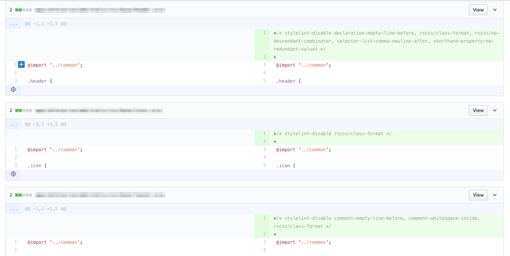

# stylelint-disable-all

> Adds exceptions to all existing Stylelint or Eslint violations

Use this to introduce CSS and JavaScript linting to legacy projects that have a lot of existing code that'd be too much effort to fix all at once.

Compatible with [Stylelint] for CSS linting, and [Eslint] for JavaScript linting. For CSS, it supports `.css`, `.scss`, and `.less` files.

## How it works

This utility adds `/* stylelint-disable */` pragma to all files that are currently violating the Stylelint rules. As a result, Stylelint will only take effect for new code, leaving old code un-linted.

Also works for Eslint for JavaScript linting.

```diff
+/* stylelint-disable shorthand-property-no-redundant-values */

 div {
   padding: 8px 8px;
 }
```

## Installation

```sh
yarn global add stylelint-disable-all
# or
npm install -g stylelint-disable-all
```

## Usage

Run [Stylelint] or [Eslint] with the `-f json` flag (JSON formatter), and pipe it to stylelint-disable-all. **This will modify files right away,** so first make sure you're on a clean Git commit.

```sh
# CSS
./node_modules/.bin/stylelint "path/to/css/**/*.css" -f json | stylelint-disable-all
```

```sh
# or JavaScript
./node_modules/.bin/eslint "path/to/js/**/*.js" -f json | stylelint-disable-all
```

When this is done, inspect the mess that it creates.

```sh
git status
```

> 

[Stylelint]: http://stylelint.io/
[Eslint]: http://eslint.org/

## Thanks

**stylelint-disable-all** © 2017+, Rico Sta. Cruz. Released under the [MIT] License.<br>
Authored and maintained by Rico Sta. Cruz with help from contributors ([list][contributors]).

> [ricostacruz.com](http://ricostacruz.com) &nbsp;&middot;&nbsp;
> GitHub [@rstacruz](https://github.com/rstacruz) &nbsp;&middot;&nbsp;
> Twitter [@rstacruz](https://twitter.com/rstacruz)

[](https://github.com/rstacruz) &nbsp;
[](https://twitter.com/rstacruz)

[MIT]: http://mit-license.org/
[contributors]: http://github.com/rstacruz/stylelint-disable-all/contributors
